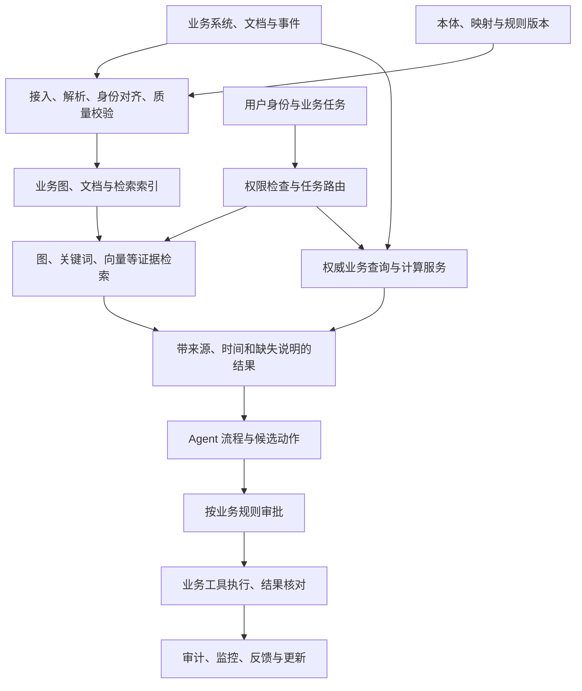

# 本体 + GraphRAG + Agent：从 0 到 1 项目落地手册

本文提供一套贯穿需求调研、方案设计、落地实施、上线验收的企业项目方法。以“供应商中断后的影响评估与应对”为贯穿案例，可替换为质量异常、设备维护、客服协同等场景。

适用对象：项目负责人、业务负责人、业务分析师、架构师、数据工程师、知识工程师、AI 应用开发、测试与运维人员。  
资料核对日期：2026-09-04。  
配套文件：[可复制工作模板](ontology-graphrag-agent-project-templates.md)、[供应链本体建模与企业应用说明](supply-chain-ontology-enterprise-guide.md)。

**推进项目的主线是：明确业务决策，确认所需知识和数据，验证检索与计算，再把经过授权的动作接入实际流程。**

本文的阶段安排、角色分工、门槛和模板为项目管理与工程建议。具体范围、指标阈值、工期和预算，需要根据客户证据和试点结果确认；不代表当前演示项目已经接通生产能力。

## 1. 先确定三项技术各自负责什么

| 层次 | 主要职责 | 供应链例子 | 应另外建设的能力 |
| --- | --- | --- | --- |
| 本体 | 统一业务对象、属性、关系、身份和语义约定 | 供应商、工厂、物料、供货安排、库存、事件、评估、措施 | 数据采集、质量治理、查询、计算与执行 |
| 实例数据与知识图谱 | 按模型组织具体业务事实，并保留来源与时间 | A 工厂在某期间向 F1 工厂供应物料 C | 事实核验、更新、冲突处理、权限与删除机制 |
| GraphRAG | 利用实体及关系组织检索，结合原文证据生成回答 | 从停供通知关联到供应地点、物料和处置资料 | 精确业务计算、业务授权和交易执行 |
| Agent | 在指定任务范围内选择工具、推进步骤、申请审批及交接 | 查询影响、调用缺口计算、整理候选方案、提交待审批任务 | 服务端权限、计算服务、审批流程和业务接口 |

需要区分两个概念：

- **广义 GraphRAG：**使用图结构辅助检索增强生成的一类方案，可以组合企业业务图、文档、向量检索与结构化查询。
- **Microsoft GraphRAG：**一个具体开源实现。其索引流程支持文本中的实体与关系抽取、社区发现和摘要等处理，并提供多种查询方式。自动抽取得到的图，需要经过企业身份对齐、事实审核和语义治理后，才能作为业务依据。[官方索引说明](https://microsoft.github.io/graphrag/index/overview/)

本体采用 RDF/OWL 还是其他可管理的模型表达，图数据是否独立存储，均需要在架构决策中说明。不要因选用了一个 GraphRAG 库，就默认已经具备企业业务本体、数据权限或业务执行能力。

## 2. 项目阶段、交付物和放行条件

整个项目包含四个主要环节。上线验收进一步区分“允许进入生产”和“完成生产观察后的最终验收”。

| 环节 | 要回答的问题 | 主要产出 | 放行条件 | 负责确认的人 |
| --- | --- | --- | --- | --- |
| 需求调研 | 谁在什么情况下，需要依据什么信息，完成什么判断或动作？ | 场景清单、业务流程、数据接口清单、基线、一期范围、验收草案 | G1：核心场景有负责人、有真实案例、关键前置条件有证据或明确处置 | 业务负责人、产品负责人、数据与系统负责人 |
| 方案设计 | 怎样建模、怎样取证、怎样计算、怎样调用工具？ | 本体与映射、检索策略、工具与权限契约、原型、评测计划、架构决策 | G2：关键技术假设通过小范围验证，范围及验收口径已确认 | 架构负责人、业务负责人、数据负责人 |
| 落地实施 | 能否跑通真实数据上的完整业务任务？ | 数据处理、检索与计算、Agent 流程、用户界面、测试及可观测性 | G3：候选版本完成约定功能与适用测试，可进入业务验收 | 技术负责人、测试负责人、业务代表 |
| 上线验收 | 是否可靠、可控、可运维，业务是否接得住？ | UAT、灰度计划、回滚与接管演练、培训和运维包 | G4：上线准入；G5：生产观察完成且最终验收通过 | 业务签收人、运维负责人、相关授权责任人 |

门槛只约束本次发布范围。未解决的外部依赖可以移出本次范围，前提是业务负责人确认替代流程和影响；已经确认的权限泄漏、关键计算错误或重复业务写入，应按风险作为阻断事项处理。

需求到证据必须能够追踪：

```text
场景 SC → 需求 REQ → 本体概念 ONT → 数据源 DATA
        → 查询/规则 RULE → 工具 TOOL → 测试 TC → 验收证据 EV
```

## 3. 需求调研：把“想做 AI”转成可验收的业务任务

### 3.1 会前准备

先请客户准备三类资料：前三项痛点、两个真实事件、现有系统清单。资料准备模板面向客户；接口验证、估算判断和技术风险记录放在内部工作区。

两个真实事件优先选择一个正常完成、一个异常或处理困难的案例，避免只研究成功路径。收集时间线、涉及角色、业务单据、使用的数据、实际决策及最终结果，敏感信息按约定脱敏。

建立事实台账，将每条发现标为：

- **已证实：**有操作记录、样本、接口调用或责任人确认支持。
- **待验证假设：**例如“ERP 可以提供实时可用库存”。
- **待确认：**尚缺字段定义、权限、接口、规则或负责人。

### 3.2 按业务事件访谈，而非按功能名访谈

围绕一项事件，至少追问以下问题：

| 调研内容 | 需要问清楚的问题 | 应记录的证据 |
| --- | --- | --- |
| 触发 | 谁在什么情况下开始处理？频率、峰值和渠道是什么？ | 真实工单、消息或事件记录 |
| 判断 | 处理者需要做哪几个判断？依据哪些规则？ | 实际操作、审批说明、规则文档 |
| 数据 | 每一步看什么字段？在哪个系统？哪个字段是权威来源？ | 样本、字段说明、编码对应 |
| 异常 | 信息缺失、矛盾、过期或系统不可用时怎么办？ | 失败案例、人工补救流程 |
| 动作 | 最终只是回答，还是创建任务、修改数据或发出通知？ | 目标单据、流程状态、责任与权限 |
| 成本 | 目前查证、等待、审批和返工分别需要多久？ | 有时间戳的记录或结构化抽样 |
| 验收 | 什么结果算完成？谁认定正确？哪些错误不能接受？ | 业务评分规则和签收责任人 |

至少覆盖业务负责人、一线使用者、数据与系统负责人，以及涉及审批或执行的岗位。同一句“订单受影响”，不同角色可能使用不同时间窗口或统计口径，需要当场记录差异。

### 3.3 把流程拆成不同性质的任务

供应商中断场景可以拆为：

| 子任务 | 需要的能力 | 完成依据 |
| --- | --- | --- |
| 识别通知中涉及的供应商、地点和事件时间 | 文档解析、实体匹配、必要的人工确认 | 与原文和主数据对应 |
| 查询实际供货依赖 | 本体映射、图查询或结构化查询 | 当前有效的供货及物料关系 |
| 找到相关处置规则与历史案例 | 混合检索或 GraphRAG | 原文证据及适用条件 |
| 计算库存缺口和影响任务 | 权威业务数据与计算服务 | 经确认的数量、时间口径 |
| 生成候选措施说明 | 规则过滤、检索和生成 | 认证、产能、交期、成本依据 |
| 提交审批或业务单据 | 工作流和业务 API | 审批记录、单据及结果回执 |

同一个业务场景可以同时包含检索、计算和执行。分别定义完成条件，才能判断问题出在数据、模型、检索、生成还是流程。

### 3.4 验证数据与接口可用性

每个必要数据源至少核查：

- 数据负责人、权威字段、对象编码、单位和时间口径；
- 合法可用的接入方式、身份及权限范围；
- 样本覆盖、缺失与错误情况、历史数据可获得性；
- 更新、纠错、删除和撤权方式；
- 查询限制、分页、超时、限流和变更通知；
- 如有写操作，确认幂等、查询执行结果、撤销或补偿条件。

**人工能在界面查询，不足以证明 Agent 有可用接口。** 在测试环境或约定范围内取得实际调用证据；没有接口时，把可接受的文件导入、人工确认或转人工路径写入范围，并标明时效影响。

### 3.5 建立基线与一期范围

基线至少包含：处理量、处理时长分布、人工触点、返工或遗漏、信息更新时间和典型错误后果。数据不足时先安排测量，记录基线尚未建立。

从业务价值、关系检索必要性、数据就绪程度、接口可行性、错误后果、使用频率和验收可测性选择试点。涉及高价值但证据不足的场景，可单独列为探索任务。

范围清单分为“本次交付”“满足条件后交付”“后续阶段”“当前暂不可评估”，逐项记录前置条件和责任人。

G1 的完成证据是：已确认的场景卡、现状流程、数据与接口验证记录、业务基线、一期边界、异常出口及验收草案。存在未知项时，应决定补验证、缩范围或暂缓该项，不能直接写成固定交付承诺。

## 4. 方案设计：让本体、检索和 Agent 各有明确边界

### 4.1 先写业务问题，再设计最小本体

先列本体必须支持的问题，例如：

1. 某事件影响哪些供应地点和当前有效供货安排？
2. 哪些物料在指定工厂、指定时间窗口内可能出现缺口？
3. 哪些生产任务或订单依赖这些物料？
4. 哪些替代来源在物料、地点、有效期和客户要求上合格？
5. 某次评估引用了哪些事实、规则和假设？
6. 某项措施由谁批准，对应哪个执行单据和结果？

每个问题必须能指向对象、关系、字段和数据源。只为本期问题补充必要模型，后续问题再推动扩展。

本体设计至少明确：

| 设计项 | 需要确认的内容 |
| --- | --- |
| 对象粒度 | 供应商法人、工厂、物料版本、订单行是否分别建模 |
| 唯一身份 | 主键、外部编码、别名、合并与拆分规则 |
| 关系语义 | 起点、终点、含义、方向、基数和有效期 |
| 属性语义 | 类型、单位、枚举、必填条件、权威来源 |
| 时态 | 事实何时有效，系统何时取得或确认该信息 |
| 来源 | 哪个系统记录、文档片段或审核记录支持这一事实 |
| 规则 | 哪些只是概念定义，哪些需要数据校验或计算服务执行 |
| 变更 | 模型版本、旧数据迁移、查询兼容和维护责任 |

RDF 方案可使用 SHACL 验证类型、必填和关联条件等数据约束；其他存储方案也应实现对应校验。SHACL 的职责是按条件验证 RDF 图。[W3C SHACL](https://www.w3.org/TR/shacl/)

### 4.2 区分权威业务事实与文档抽取结果

建议分别治理两类内容：

- **业务事实：**来自主数据、订单、库存、认证或人工确认的记录，按权威来源和业务有效期管理。
- **文档抽取结果：**来自通知、报告、会议纪要等文本，保留原文位置、抽取版本、置信信息和审核状态。

文档里的“供应商可能停供”应保留为有来源的待核实陈述。只有经过约定的匹配与核验，才能影响正式业务状态。

实体对齐应优先使用主数据编码和确定性规则。名称相似、简称一致只作为候选匹配依据；无法确认时进入待处理队列。不同来源冲突时按事先约定的来源优先级、时间与业务审核处理，不能默默覆盖。

### 4.3 按问题类型选择检索与计算方式

| 问题类型 | 优先验证的实现方式 | 不应混淆的边界 |
| --- | --- | --- |
| 查某条制度、某份通知或某个术语 | 关键词、向量、重排与原文引用 | 相似段落不一定适用当前对象和时间 |
| 查询某供应商的上下游依赖 | 参数化图查询或结构化查询，必要时补充文本证据 | 精确关系查询不必经过自由文本生成 |
| 围绕某对象跨文档查证 | 图邻域与文本联合检索；可评估 Local Search | 检索结果需要主数据身份与时间约束 |
| 总结大量报告中的共同主题 | 可评估 Global Search | 主题摘要不能充当精确全量数量统计 |
| 起点宽泛，需要逐步探索关联问题 | 可评估 DRIFT 或受限迭代检索 | 需控制步骤、费用和退出条件 |
| 当前库存、订单金额、缺口和产能 | 权威 API、SQL、图查询或计算服务 | 不依赖旧文档摘要生成当前数值 |
| 创建任务、调整状态、采购或调拨 | 明确的业务工具和审批流程 | 检索到操作说明不等于获得执行权限 |

Microsoft GraphRAG 的 Local Search 结合实体图与原文，Global Search 利用社区报告处理整体性问题，DRIFT 在探索中结合社区信息；这些能力应按问题验证。[官方查询说明](https://microsoft.github.io/graphrag/query/overview/)

### 4.4 用基线比较决定 GraphRAG 的投入

在相同数据范围、权限、测试集和可比资源预算下，至少比较：

1. 原有业务查询或人工检索流程；
2. 关键词、向量与重排组成的常规检索；
3. 增加图关系检索后的方案。

分别记录证据覆盖、关键结论、错误类型、耗时、维护复杂度和费用。对关系依赖明显的案例单独分析，不能只看混合平均分。

如果图检索没有提供可确认的收益，可以简化该类问题的处理路径，继续复用本体中的业务定义。Microsoft 官方也提示大规模索引可能消耗较多模型资源，应先做小范围实验。[GraphRAG 入门说明](https://microsoft.github.io/graphrag/get_started/)

### 4.5 设计数据与在线任务的连接方式



这是逻辑分工，不要求每个方框独立部署。数据量和权限允许时，可以采用较少的服务完成试点；只有证据表明需要时再拆分。

快速变化的库存、订单状态等信息应优先在决策时查询权威来源，或使用经过时效验证的同步数据。长期知识、流程说明和历史案例可以进入检索索引。回答中显示数据截至时间。

### 4.6 权限要覆盖派生内容

设计文档级、对象级、字段级和工具级权限，并记录哪些控制适用于本期场景。用户身份和权限由服务端提供，不能由模型自由填写。

权限需要覆盖原文、片段、实体关系、跨文档摘要、向量、缓存和导出。由多份资料生成的摘要，如果混合了不同权限内容，应按可见范围分别生成，或采用足够严格的访问控制；不能只过滤引用链接而把受限事实留在回答中。

撤权应及时在查询和执行路径生效。索引重建尚未完成时，可隔离受影响内容；旧版本回滚仍需遵循当前撤权和删除要求。

### 4.7 设计 Agent 的任务边界与工具契约

先判断流程是否可预先定义。固定步骤可以使用确定性工作流；需要根据中间证据选工具时，再引入受限的动态规划。只有角色、数据或并行收益明确时，才增加多个 Agent。

每个工具必须写清：业务目的、输入结构、调用身份、权限、返回结构、数据时间、错误类别、超时、限流和审计。写工具额外规定实际副作用、审批条件、幂等、结果查询及失败处理。

推荐使用可恢复的任务状态：

```text
已受理 → 待补信息 → 查询与评估 → 待审批 → 执行中 → 已核实完成
                  ↘ 无足够证据 / 需人工处理
                                      ↘ 执行结果待核实
```

审批应绑定操作对象、数量、金额或其他重要参数，以及相关业务版本。审批后关键参数变化时，按约定重新审批。执行前由服务端再次检查条件。[OWASP 交易授权建议](https://cheatsheetseries.owasp.org/cheatsheets/Transaction_Authorization_Cheat_Sheet.html)

每项任务设置时间、工具调用次数、重试次数和费用预算。预算耗尽后给出当前进度、已知事实和人工接管信息，避免无限规划或重试。

### 4.8 G2：什么时候可以开始承诺实施

应具备已确认的需求与原型、本体和字段映射、接入验证、关键规则样例、检索基线对比、工具契约、权限设计、评测集结构和工作分解。

关键依赖尚未验证时，只估算相应验证任务或有条件的实施区间。固定交付范围与验收承诺应建立在这些证据上。

## 5. 落地实施：以完整业务任务逐步交付

### 5.1 工作包与完成证据

| 工作包 | 主要工作 | 可检查的完成证据 |
| --- | --- | --- |
| I0：最小运行环境与接入验证 | 建立开发、测试环境，身份、配置、日志与受控样本接入 | 一个授权用户能查询一份真实来源数据；关键依赖调用记录 |
| I1：数据与知识处理 | 文档解析、表格保留、分段、对象对齐、质量校验、来源记录 | 样本逐项核对；异常可隔离；数据可重复处理 |
| I2：本体与业务图 | 实现实体、关系、时间、映射和必要约束 | 业务问题能映射到有效查询；关键关系有来源 |
| I3：检索与计算 | 完成基线检索、图检索、路由和权威计算工具 | 同一测试集对比；关键结论可追查到证据和计算 |
| I4：Agent 与业务流程 | 实现工具、状态恢复、审批、结果核对、人工接管 | 正常任务、缺信息、超时、重复触发等路径可核查 |
| I5：用户工作台 | 展示结果、证据、时间、待确认项、动作预览和进度 | 目标用户能完成工作并理解何时需要确认 |
| I6：发布候选与运维 | 完成适用回归、性能、权限、费用、备份和演练 | 固定版本的验证报告及可交接运行包 |

可以并行建设独立数据源或工具，但应尽早跑通一条从真实输入到业务输出的完整任务。演示数据、模拟接口与真实接口必须标明，避免把前端演示当成接入完成。

### 5.2 数据处理的具体要求

文档处理应保留标题层级、表格字段对应、页码或段落定位。OCR、合并单元格、图片注释和附件关联要按样本检查，避免只验证“解析出了文本”。

抽取流水线可采用：

```text
原始资料 → 解析与定位 → 候选实体/关系抽取 → 身份匹配
        → 规则校验与必要审核 → 发布事实/索引 → 记录血缘
```

为事实或证据保存适用的元数据：来源 ID、来源版本、原文位置、业务有效期、采集时间、审核状态、抽取或映射版本、可见范围。

对于纠错和删除，追踪其影响到片段、关系、摘要、嵌入与缓存。事实仍被其他合法来源支持时，保留该事实并更新证据；没有支持时撤回或标为失效。

### 5.3 检索输出采用结构化证据包

检索或查询服务应向生成与流程层提供：

- 规范化对象 ID 及用户输入的对应关系；
- 查询范围、用户可见范围和数据截至时间；
- 相关事实、原文摘录、关系路径和可追溯位置；
- 计算结果及规则版本；
- 缺失、冲突、过期和待确认项。

生成层据此区分“已知事实”“计算结果”“建议”和“待确认信息”。引用要支持相邻结论；只有可点击链接而没有支持关系，不算证据完整。

### 5.4 写操作按实际副作用核对

同一个逻辑操作使用稳定的幂等键。网络重试、用户重复点击或消息重复投递，不应生成新的业务动作。服务端还要识别同一键搭配不同参数的异常情况。

如果下游已执行但响应丢失，先查单或对账。下游不支持可靠去重且结果未知时，进入“执行结果待核实”，不要盲目重发。幂等需要落实到服务端及实际执行边界。[AWS 幂等 API 说明](https://aws.amazon.com/builders-library/making-retries-safe-with-idempotent-APIs/)

多步骤任务中途失败时，记录哪些步骤已经完成。补偿必须符合业务规则和权限；软件回滚不会自动撤销已经创建的订单或发出的通知。

### 5.5 版本、日志与迭代控制

每个可验收版本记录：代码、本体、身份映射、业务规则、抽取提示、生成提示、模型配置、嵌入与索引、工具契约和权限策略。

每个任务通过统一追踪 ID 连接请求、检索、计算、工具、审批和执行结果。日志记录排错所需的信息，并限制敏感正文、个人数据和凭证进入日志。

按变更影响决定验证范围：本体变化检查映射和查询；切分或嵌入变化检查检索；生成模型变化检查事实、引用和拒答；权限或工具变化检查授权和副作用。

每次候选发布运行一次完整的适用门槛；修复后重点复测受影响范围及必要关键回归。完成定义满足、适用测试通过、无已知阻断事项后结束该轮，不因泛化优化反复重开已完成范围。

## 6. 上线验收：分层评价，验证完整任务

### 6.1 在开发前约定测试资产

| 测试资产 | 用途 | 管理方式 |
| --- | --- | --- |
| 开发集 | 调整本体、抽取、检索和工作流 | 可反复使用，不作为泛化成绩 |
| 离线保留集 | 验证与基线差异和未见案例表现 | 冻结版本，限制针对答案调参 |
| 业务验收集 | 由实际业务人员判断是否可用 | 使用未参与调参的真实案例和已确认规则 |
| 安全与异常集 | 验证越权、无答案、冲突、过期、超时和副作用 | 按风险路径固定回归 |
| 回归集 | 保存已修复问题，防止再次出现 | 与后续变更影响关联 |

按事件、对象、资料来源或时间分组，避免同一事件的不同问法分散到开发集和保留集。检索所需原始业务资料可以入库，但标准答案、评分说明和专家解析不得混入检索资料。

历史回放仅使用当时可获得的信息。保留集案例被用于修复后，转入回归集并补充新的保留案例，不能继续宣称其完全未见。

样本规模应按场景差异、预期错误频率和错误后果确定。报告样本数及覆盖分布；少量演示题不能证明整体质量或低频风险已经满足要求。

### 6.2 指标要写清分子、分母和判定依据

| 层级 | 指标与定义 | 需要补充的判定条件 |
| --- | --- | --- |
| 数据 | 关键字段正确率＝正确字段数 / 抽检字段数 | 区分错误、缺失、过期；关键字段单列 |
| 实体与关系 | 关系精确率＝正确抽取关系数 / 抽检抽取关系数；召回率＝恢复的标准关系数 / 标准关系数 | 使用专家标注子集，包含身份、时间、方向判断 |
| 业务影响范围 | 精确率＝正确识别对象数 / 识别对象数；召回率＝正确识别对象数 / 应识别对象数 | 固定时间、权限、物料和需求口径；关键漏报单列 |
| 检索 | 必要证据覆盖率＝预算内覆盖的必要证据项数 / 该题必要证据项数 | 固定条数或上下文预算；存在等价证据时预先定义可接受集合 |
| 多跳证据 | 完整证据链成功率＝找齐一套有效必要证据的题数 / 需多跳证据的题数 | 各节点分别命中但无法支持同一结论，不算链路完整 |
| 回答 | 事实支持率＝被有效证据支持的可核查主张数 / 全部可核查主张数 | 同时检查关键结论正确与完整，避免只说少量无关事实 |
| 引用 | 引用支持率＝确实支持对应主张的引用数 / 抽检引用数 | 引用可访问、时效有效且语义支持，三者分别记录 |
| 数值与规则 | 数值任务通过率＝满足约定数值、单位和范围规则的任务数 / 数值任务数 | 容差由业务确认，不能只检查表述相似 |
| 拒答与接管 | 正确拒答率＝正确拒答或转人工数 / 应拒答或转人工数 | 同时报可回答案例的错误拒答率，防止靠拒答抬高成绩 |
| 端到端任务 | 完成率＝满足全部完成条件的任务数 / 约定范围内发起的任务数 | 失败、超时和人工纠错保留在分母；自主和协助完成分列 |
| 写操作 | 重复副作用率＝产生重复业务结果的逻辑任务数 / 执行的逻辑写任务数 | 以业务流水和单据为证据，不以 HTTP 成功或模型自报成功为准 |
| 权限 | 越权成功案例数 / 执行的越权测试案例数 | 按身份、对象、字段、工具和派生产物分组 |
| 运行 | 端到端延迟、超时率、失败率、数据新鲜度 | 同时报全部请求和成功请求；异步受理与最终完成分开 |
| 成本 | 成功任务成本＝约定口径总成本 / 成功业务任务数 | 纳入失败重试和索引摊销；说明观察期和任务量 |
| 业务价值 | 处理时长、查证工作量、返工、接管和实际任务效果 | 与复杂度相近的原流程比较，包含审批与返工时间 |

阈值在 G2 前按场景约定，可在受控试点取得证据后由双方正式调整。不要用一个“准确率达到某个百分比”替代分层验收。

关键权限与副作用测试可以要求在指定测试集中零失败；必须同时报告测试数量和覆盖范围。测试零发现不等于实际风险为零，仍要具备运行监控与接管能力。

### 6.3 必测的安全与异常路径

| 场景 | 应验证的行为 |
| --- | --- |
| 跨部门、跨租户或换角色查询 | 检索和工具执行都执行服务端授权，未授权摘要也不能进入上下文 |
| 文档、网页或工具结果中夹带指令 | 作为外部数据处理，不能据此扩大权限、变更目标或调用未授权工具 |
| 缺少数据、资料矛盾或数据过期 | 显示具体缺口，按规则暂停结论、补问或转人工 |
| 审批后关键参数或单据版本变化 | 原审批按规则失效，执行前重新核验 |
| 重复点击、重复消息、并发请求 | 同一逻辑写操作不产生重复业务结果 |
| 下游已执行但响应丢失 | 查结果、对账或进入待核实，不盲目再次执行 |
| 多步骤任务中断 | 已完成步骤可追查，恢复或补偿路径明确 |
| 连续工具失败或反复规划 | 达到次数、时长或费用上限后停止并接管 |
| 原文删除或权限撤销 | 图、向量、摘要、缓存和旧版本查询均遵守当前可见性要求 |

工具应按所需功能和权限收敛，高影响动作按规则审批；相关原则可参考 OWASP 对过度代理能力的建议。[OWASP Excessive Agency](https://genai.owasp.org/llmrisk/llm062025-excessive-agency/)

### 6.4 G4：上线准入与灰度发布

上线前至少具备：

- 已签认的 UAT 结果、版本清单、残余问题与责任人；
- 数据和用户权限配置，以及关键动作的实际验证记录；
- 监控、告警、值班、升级、人工接管和故障说明；
- 数据及索引备份、恢复或重建方法与验证记录；
- 停止写入、版本切回、下游不可用等演练证据；
- 用户培训、管理员指南、知识与规则更新责任。

可按任务风险采用“历史回放 → 只读影子运行 → 指定用户试用 → 带审批的写操作 → 扩大已验证范围”的顺序。影子运行不产生业务写入，也不替代原流程做实际决定。

在发布前定义每一步的扩大、暂停和退出条件。例如出现已确认越权、重复高影响写入、关键计算错误或超过约定的数据陈旧边界时，暂停扩大，必要时关闭相关工具并转人工。

回滚代码和索引不会撤销已经发生的业务动作。已创建的单据、已发送的通知或部分完成的任务，需要按业务流程对账和补偿。

### 6.5 G5：最终验收与运维移交

约定生产观察窗口、用户范围、任务量和事件覆盖，不把“已部署”当作最终验收。没有足够真实事件时，记录不足，结合受控回放和分阶段验收，而不虚构业务效果。

最终签收应覆盖业务完成度、运行质量、费用、维护能力和人员接手情况。业务负责人认定业务可用，数据负责人认定更新责任，运维负责人认定可运行和可恢复。

项目风险评估、实际用户参与、部署前后测量和运行监控，可参考 NIST AI RMF；本文的具体门槛仍由项目按使用情境定义。[NIST AI RMF Core](https://airc.nist.gov/airmf-resources/airmf/5-sec-core/)

## 7. 上线后的数据、模型和索引维护

维护关系至少覆盖：

```text
来源记录 → 文档片段 → 实体/关系 → 摘要或报告 → 向量/缓存 → 回答或任务
```

Microsoft GraphRAG 的产物包括文档、文本单元、实体、关系、社区和报告等，因此需要管理多层派生内容。[官方索引产物说明](https://microsoft.github.io/graphrag/index/outputs/)

源资料删除、纠错或撤权时，定位受影响产物并失效、删除或重建。先控制可见性，再完成必要重算。业务图、向量和摘要的更新策略可以不同，但回答需要知道使用了哪个版本和截至时间。

每次发布成套记录模型和索引依赖；回滚仍要应用当前权限和删除标记，避免重新暴露已撤销内容。不要默认已有实现支持完整增量更新，应对选定版本验证新增、修改、删除和恢复行为。

按约定频率复核数据新鲜度、未知实体、缺失关系、问题类型变化、失败聚类、接管率、任务成本和业务效果。明确修数据、修映射、修规则、修检索和修流程的责任分工。

## 8. 团队责任与协作节奏

| 责任角色 | 核心职责 | 需要签认的内容 |
| --- | --- | --- |
| 业务发起人 | 决定价值、优先级、范围和资源 | 一期目标、范围变更、最终价值 |
| 产品负责人 / 业务分析师 | 场景、流程、需求和追踪矩阵 | 场景卡、验收口径、用户反馈 |
| 领域专家 / 本体负责人 | 业务定义、关系、约束和模型变更 | 本体、关键规则与案例标注 |
| 数据与系统负责人 | 接入、权威来源、质量、权限和更新 | 数据契约、接口证据、运维责任 |
| 架构与 AI 应用负责人 | 检索、工具、流程和整体技术决策 | 设计决策、候选版本及技术风险 |
| 测试负责人 | 测试集、分层评测、异常与验收证据 | 测试报告、覆盖与遗留问题 |
| 运维及权限责任人 | 发布、监控、恢复、接管和安全控制 | 上线准入、演练和运行移交 |

小团队可以一人承担多项职责，但业务验收应有独立业务代表参与，不能仅由开发自评。

建议按固定节奏开展：业务案例评审、数据与接口问题处理、工作成果演示、范围与风险决策。每次会议记录决定、证据、责任人和期限；未决事项进入同一台账，避免在不同文档中出现互相冲突的承诺。

## 9. 工作量和预算怎样估算

按“公共能力 + 场景增量 + 数据与接口专项 + 验证上线 + 持续运行”分解工作量。

| 估算部分 | 典型内容 | 影响工作量的事实 |
| --- | --- | --- |
| 公共能力 | 身份、检索入口、日志、任务状态、配置与管理 | 是否已有可复用平台及其实际能力 |
| 场景增量 | 对象、关系、规则、界面、工具和异常路径 | 问题复杂度、写操作风险、验收差异 |
| 数据与接口专项 | 文档解析、编码对齐、主数据补齐、接口适配 | 来源数量、数据质量、权限和变更机制 |
| 验证与上线 | 专家标注、评测、UAT、演练、培训 | 场景覆盖、关键错误后果、环境要求 |
| 持续运行 | 索引更新、存储、推理、监控、人工审核和维护 | 数据变化量、查询量、任务成功率和服务要求 |

对于每个工作项，记录依赖、负责人、完成定义、估算区间和估算依据。资料不足时单列验证任务，标明剩余实施工作暂不可评估。

周期由关键路径决定：数据授权、接口开通、主数据治理、业务规则确认和用户验收可能比开发更早限制进度。不能把所有人天简单除以团队人数得到工期。

费用核算同时关注首次全量索引、日常增量、版本升级重建、在线检索生成、工具调用、失败重试、存储，以及业务专家审核维护。索引成本按约定期间或成功任务量摊销，避免只报价单次模型调用。

## 10. 供应链试点的贯穿示例

以下 SC-01 是范围设计示例，条件仍需与客户验证。

| 项目 | 示例内容 |
| --- | --- |
| 目标用户 | 指定工厂的采购与生产计划人员 |
| 业务事件 | 收到供应商停供或延迟通知 |
| 本期决策 | 确认指定时间窗口内可能缺料的任务，整理候选应对依据 |
| 最小模型 | 供应商、生产地点、物料版本、供货安排、需求任务、事件、评估和措施 |
| 数据 | 供应商与物料主数据、有效供货关系、BOM、库存与在途、需求计划、认证及处置资料 |
| GraphRAG 作用 | 围绕事件和对象检索跨文档通知、规则、认证与历史案例，关联可核查原文 |
| 精确查询与计算 | 确定有效依赖，按时间和数量计算缺口，过滤替代资格 |
| Agent 作用 | 检查输入、调用查询与计算、汇总证据、记录缺口、交给用户确认 |
| 首次发布动作范围 | 只读评估和方案草稿；若需要写入，再单独验证工具与审批 |
| 异常出口 | 对象匹配不明、关键数据过期、来源冲突、接口失败时补问或转人工 |
| 验收证据 | 人工确认的影响集合、计算明细、原始证据、任务流水和用户评分 |

一条需求的追踪示例：

```text
SC-01 供应商中断评估
  → REQ-03 找到有效供货依赖
  → ONT-SupplyArrangement 供货安排及有效期
  → DATA-ERP-01 供货记录与物料版本
  → RULE-03 按接收工厂、有效期和物料版本过滤
  → TOOL-READ-03 查询有效供货安排
  → TC-03-01 当前有效；TC-03-02 已失效；TC-03-03 无权限
  → EV-03 查询结果、授权日志、业务核对记录
```

本体用于定义“有效供货安排”及关联对象；检索补充支持材料；规则和工具执行过滤；Agent 组织步骤和说明。每一层都能分别验证。

## 11. 启动时优先完成的事项

1. 指定业务发起人、实际使用者、数据负责人和最终验收人。
2. 收集前三项痛点、两个真实事件、现有系统和可提供样本。
3. 选定一个明确决策，画出现状步骤与异常处理。
4. 写出第一张场景卡和需求到证据追踪矩阵。
5. 验证最关键的数据源和接口，确认权限与时效。
6. 建立业务词汇、对象身份和必要关系的最小版本。
7. 准备有身份、时间和证据要求的开发样本与独立验收计划。
8. 跑通常规检索或结构化查询基线，再比较图检索的增益。
9. 通过第一条完整业务任务确定后续实施范围和估算。
10. 在开发扩展前，确认上线准入、生产观察和最终验收的责任及条件。

## 12. 参考资料与适用边界

本文将来源中说明的技术能力与通用原则，用于构建一套项目实施建议；阶段门槛、任务划分、模板和阈值制定方法为本文的工程设计，并非来源直接规定的统一标准。

- [Microsoft GraphRAG 索引](https://microsoft.github.io/graphrag/index/overview/)
- [Microsoft GraphRAG 查询](https://microsoft.github.io/graphrag/query/overview/)
- [Microsoft GraphRAG 入门](https://microsoft.github.io/graphrag/get_started/)
- [Microsoft GraphRAG 索引产物](https://microsoft.github.io/graphrag/index/outputs/)
- [W3C SHACL](https://www.w3.org/TR/shacl/)
- [OWASP 过度代理能力](https://genai.owasp.org/llmrisk/llm062025-excessive-agency/)
- [OWASP 交易授权](https://cheatsheetseries.owasp.org/cheatsheets/Transaction_Authorization_Cheat_Sheet.html)
- [AWS 幂等 API 与安全重试](https://aws.amazon.com/builders-library/making-retries-safe-with-idempotent-APIs/)
- [NIST AI RMF Core](https://airc.nist.gov/airmf-resources/airmf/5-sec-core/)

具体技术版本、云环境、部署方式和厂商能力应在方案验证时锁定，并在实际安装或集成前重新核验。当前本体演示项目的图谱查看、路径查找和规则查询，不应作为 GraphRAG 或生产 Agent 已实现的证据。
