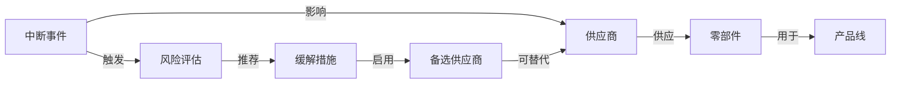

# 供应链中断与风险传播：本体建模与企业应用说明

本文结合当前项目中的「供应链中断与风险传播」本体，说明四个问题：它如何建模，企业怎样应用，落地需要完成哪些工作，以及为什么选择本体建模。

适用读者：供应链、采购、生产运营负责人，以及业务分析、数据与系统建设团队。
核对日期：2026-09-04。
配套材料：[供应链本体客户演示稿](supply-chain-ontology-customer-demo-script.md)。

**这个本体，是把“供应链出了问题后，企业如何查影响、做判断、采取措施”组织成一套明确的业务模型。**

它定义了业务对象、对象之间的关系，以及判断所需的信息。企业真正使用时，还要把实际数据、计算规则和执行流程接到这套模型上。当前系统里的版本，适合用来理解和讨论这套业务结构。

## 1. 当前本体如何建模

可以沿着一个问题理解这套模型：**供应商发生停供，企业到底应该如何应对？**

当前本体包含 **7 类实体、40 个属性、7 条关系**，形成两条相互连接的主线。



若阅读器不支持 Mermaid，可按以下两条链理解：

- **影响追溯：**中断事件 → 供应商 → 零部件 → 产品线。
- **评估与应对：**中断事件 → 风险评估 → 缓解措施 → 备选供应商 → 可替代的主供应商。

上面一条回答“影响可能传到哪里”，下面一条回答“如何评估和组织应对”。图上的“触发、推荐、启用”都是关系定义，当前页面没有因此自动执行这些动作。

### 1.1 为什么选择这七类实体

每类实体的设计，都对应一个业务问题。

| 实体                           | 为什么需要单独建模           | 典型属性                                 |
| ------------------------------ | ---------------------------- | ---------------------------------------- |
| 供应商 Supplier                | 明确供货来源及其风险特征     | 编码、层级、交付评分、是否单一来源       |
| 零部件 Component               | 找出供应中断向生产传导的依赖 | 库存缓冲天数、补货提前期、关键程度       |
| 产品线 ProductLine             | 把物料问题连接到业务影响     | 产品线编码、生产状态、年收入             |
| 中断事件 DisruptionEvent       | 记录某次具体异常             | 类型、发生时间、预计持续时间、区域       |
| 风险评估 RiskAssessment        | 记录某一时点做出的判断       | 评估时间、预计影响时间、风险收入、置信度 |
| 缓解措施 MitigationAction      | 把应对方案作为可跟踪的对象   | 措施类型、状态、预计成本、节省时间       |
| 备选供应商 AlternativeSupplier | 描述后备来源及其条件         | 认证状态、可用产能、价格溢价             |

其中很关键的一个选择，是**把“评估”和“措施”也建成对象**。

供应链风险会变化：上午认为供应商需要七天恢复，下午得到新信息，可能变成三天。企业需要知道每次判断基于什么信息、形成于何时、推荐过什么方案，而不是不断覆盖一个“风险等级”字段。

另一个选择是明确关系的含义和数量约束。例如，“零部件用于产品线”是多对多：一个零部件可能服务多条产品线，一条产品线也需要很多零部件。因此，一个采购金额很小的零部件，也可能连接多条重要产品线。

### 1.2 类型、实例与规则的区别

`Supplier` 定义的是“供应商这一类对象”；某家具体供应商的记录，是这个类型的一个实例。`supplierId` 用来明确识别具体对象，实际接入时还需要建立不同系统之间的编码对应。

同样，定义 `daysOfSupplyOnHand` 属性，表示模型需要记录库存缓冲天数；它并没有自动取得库存、需求或在途数据，也没有自动完成计算。

**图上存在依赖路径，只能帮助圈定需要调查的范围，不能直接证明会停产。** 实际风险还取决于供货关系是否有效、缺口发生的时间和数量、可用库存，以及其他补救条件。

## 2. 企业应该如何真正应用

假设供应商 A 的一家工厂停产七天，它供应的零部件 C 被产品 P1、P2 使用。以下是说明应用方式的假设案例，不是当前系统中的真实记录或计算结果。

企业需要沿着模型，继续完成五步工作。

### 第一步：确认事件具体影响了什么

是供应商整个集团停供，还是一家工厂、一道工序停了？C 是否由受影响的工厂生产？有没有其他生产基地继续供货？

供应商处于某个受灾区域，只能成为核查线索。事件和供应商之间的实际影响关系，需要来自供应商通知、业务确认或其他可核查的证据。

### 第二步：查出实际供货依赖

A 当前向我们哪家工厂供应 C？供货份额是多少？哪些有效订单依赖这些到货？哪些产品的当前 BOM——也就是物料清单——确实使用 C？

历史上采购过，不一定代表现在仍然依赖。追溯需要考虑供货安排、物料版本、生产地点和有效期。

### 第三步：按时间计算缺口

假设 C 的库存可以支撑三天，还要核实待检库存、在途到货、其他仓库调拨、生产计划和需求变化。

可以按天或按周建立库存与需求的计算口径，例如：

```text
某时点预计库存余额
＝期初合格库存
＋截至该时点的累计可用到货
－截至该时点的累计需求
```

具体口径需要根据业务确认：哪些库存可用，哪些到货足够可靠，哪些需求必须保障，调拨能否在需要的时间前完成。已分配库存及其对应需求应统一处理，避免重复扣减；企业也可以根据业务设置安全库存阈值。

所以，**“库存三天、中断七天”是风险信号，不能直接认定停产四天。**

### 第四步：比较可以执行的方案

备选供应商 B 是否获准生产这一个物料版本？对应客户是否认可？它的剩余产能、最早到货时间能否填补缺口？

加急采购、跨仓调拨和调整生产，分别能解决多少问题、增加多少成本？同一份备选产能不能被多个方案重复使用。

这一步需要把“有一个候选来源”进一步核实为“在当前条件下能够执行的供货方案”。

### 第五步：审批、执行并跟踪结果

采购负责人选择方案，有权限的人审批，系统通过接口创建采购或调拨单。之后跟踪实际到货、生产恢复情况和成本，更新评估。

企业用户最终需要看到的，应是一张能够采取行动的风险任务卡，包含：

- 事件及证据；
- 涉及的物料、工厂、生产任务或订单；
- 缺口时间和数量；
- 候选措施及其适用条件；
- 尚待确认的信息；
- 负责人、审批状态和处理进度；
- 实际执行结果。

图谱可以作为检查关联依据的入口。风险任务卡、计算结果和执行流程共同支持日常工作。

## 3. 当前模型走向企业应用，需要怎样扩展

现有的七类实体还不够细。结合当前模型，建议重点补齐以下内容。**以下均为企业应用扩展建议，当前项目尚未实现。**

| 当前模型的简化                     | 企业应用需要补充什么                                                           | 否则容易出现什么误判                 |
| ---------------------------------- | ------------------------------------------------------------------------------ | ------------------------------------ |
| 一个 Supplier 表示整家供应商       | 区分法人、生产工厂、发货地点；多级供应风险还要有真实上下游关系                 | 把一家工厂的问题扩大为整个集团停供   |
| 用一条 supplies 表示供货           | 建立“供应商工厂—物料版本—收货工厂—有效期”的供货关系，记录份额、交期等条件 | 把历史关系当成当前依赖               |
| 库存天数挂在 Component 上          | 库存按地点、状态、时点记录；需求按订单和计划记录                               | 把其他工厂不可调拨的库存算进来       |
| 备选供应商直接替代主供应商         | 认证具体到物料、版本、生产地点、客户要求和有效期                               | 认为能替代一家供应商的全部物料       |
| 风险评估没有直接连接评估目标和证据 | 连接具体物料、工厂、产品或订单，保存数据截至时间、假设和规则版本               | 无法解释风险金额从何而来             |
| 缓解措施只有状态字段               | 连接负责人、审批记录、执行单据和实际结果                                       | 页面显示“已完成”，业务问题仍未解决 |

### 3.1 有些关系本身也需要成为业务对象

“供应商 A 供应物料 C”只是一条简单关系。但真实采购还要表达价格、份额、交期、质量认证、生效日期、收货工厂。

这些信息描述的是“这项供货安排”，就适合建立一个独立的供货关系对象。

例如，一项供货安排可以记录：

```text
供应方：供应商 A 的工厂 A1
物料：C，版本 V2
接收方：本企业工厂 F1
有效期：某一约定期间
供货条件：份额、承诺数量、交期、价格及认证依据
```

同样，“单一来源”应结合具体物料、使用地点和有效期判断。一家供应商可能是物料甲的唯一来源，却只是物料乙的多个来源之一。

### 3.2 备选供应商可以建成一种业务角色

“备选供应商”可以建成供应商在某项供货安排中的角色。同一家企业，可能是物料甲的主供，又是物料乙的备供。

这种设计能够减少重复建档，并把认证、产能和替代范围落到具体业务条件上。是否采用这一设计，应根据企业已有主数据和业务流程确定。

## 4. 背后需要完成哪些工作

企业落地可以按下面的顺序推进。

| 工作           | 需要做出的具体成果                                             | 主要参与者                 |
| -------------- | -------------------------------------------------------------- | -------------------------- |
| 明确业务决策   | 选定要解决的问题、谁做决定、现有处理方式和验收标准             | 供应链负责人、采购、生产   |
| 确定业务定义   | 明确物料、可用库存、单一来源、合格替代等概念的含义和粒度       | 业务专家、数据负责人       |
| 建立数据映射   | 对应 ERP、采购、仓储、生产、质量系统中的编码、字段和关系       | 数据工程、系统负责人       |
| 治理数据质量   | 处理重复编码、单位差异、过期关系、缺失记录，标注来源和更新时间 | 主数据团队、业务数据责任人 |
| 实现计算与规则 | 计算缺口、影响时间、方案可行性和业务影响，保留计算依据         | 计划、采购、财务、开发团队 |
| 接入业务流程   | 明确审批权限、执行接口、失败处理和操作记录                     | 流程负责人、系统集成团队   |
| 验证与维护     | 用历史事件及实际运行结果核对，持续更新模型、映射和规则         | 业务与技术共同负责         |

### 4.1 有字段，不等于已经有计算结果

模型里有一个 `revenueAtRisk` 字段，只能说明“我们需要记录预计受影响收入”。**具体怎么算，仍然需要业务规则。**

要确认评估周期、哪些订单受影响、交付能否恢复，以及同一订单是否被多个缺料事件重复累计。产品线全年收入不能直接充当一次中断的损失。

`daysOfSupplyOnHand` 也需要明确以什么需求为基础，是否包含在途，如何处理占用和待检库存，以及计算结果对应哪个时间点。

### 4.2 置信度需要依据，缺失数据需要明确表达

`confidenceLevel = High` 不能只凭 AI 自己说“我很有把握”。企业应定义它依据什么：供应商是否正式确认、库存数据是否及时、需求是否完整、哪些关键条件仍未核实。

没有查到备选来源，也应区分“确实没有”和“数据尚未维护”。这种区分直接影响是否可以放心执行方案。

### 4.3 执行需要真正的流程和接口

`MitigationAction.status` 定义了措施状态，但还需要实现状态变化的条件。例如，谁可以批准、哪些条件满足后才能执行、如何防止重复创建单据、接口失败时由谁处理，以及什么证据可以认定完成。

模型、数据和规则发生变化时，也需要有人维护版本及其对应关系，保证历史评估仍然能够解释。

## 5. 为什么要用本体来建模

本体最直接的价值，是把业务定义和关系显式地保存下来，让不同系统、分析任务和应用共同使用。

W3C 对本体的描述，也强调共享的领域术语，以及通过关系明确术语的定义。[W3C OWL 概述](https://www.w3.org/TR/owl-overview/)

对这个供应链场景，价值主要体现在四个方面。

### 5.1 统一业务含义

采购说的“可供货”、质量说的“已认证”、生产说的“可替代”，需要明确条件才能共同支持决策。

通过建模，企业可以确认每个概念指什么、适用范围是什么、由谁负责维护。数据接入和应用开发都使用这些共同约定。

### 5.2 复用业务关系

建好的供货、物料使用和替代资格关系，可以同时服务于中断追溯、供应商集中度分析、替代来源评估等问题。

新增应用时，可以复用已确认的定义、映射和关系；如果新问题需要额外信息，再针对性扩展模型。

### 5.3 让结论可以追查

当系统指出某订单存在风险，可以展示它关联的物料、供货安排和中断事件，再展示计算依据。

业务人员可以据此检查关联是否正确、数据是否及时、规则是否符合实际。模型还需要配合来源记录和计算过程，才能形成完整证据。

### 5.4 给 AI 提供受控的业务上下文

AI 可以依据已定义的对象和关系组织查询、解释结果。数量计算交给经过验证的计算服务，执行动作通过有权限的业务接口完成。

例如，AI 可以辅助从供应商通知中提取候选事件，再引用业务数据整理影响说明。事件事实、数值结论和执行条件仍需按企业规则核实。

## 6. 是否所有企业都必须使用本体

**并非所有场景都需要引入专门的本体方案。**

SQL 可以关联数据，数据库模型也能表达关系。采用本体的判断点，在于企业是否需要一套**跨系统、可复用、持续维护的业务语义**。图形展示本身并不会带来这些收益。

| 业务情况                               | 可以考虑的做法                                               |
| -------------------------------------- | ------------------------------------------------------------ |
| 一个系统、几张稳定报表、数据口径明确   | 优先使用已有数据模型和 SQL，避免增加不必要的维护工作         |
| 多个系统对同一对象使用不同编码和定义   | 建立共同业务定义、编码映射及数据责任机制，评估引入本体的价值 |
| 多级供应关系复杂，经常需要跨层追溯     | 使用明确的实体和关系组织依赖，结合实际数据和规则验证分析     |
| 多个分析应用及 AI 助手需要共用业务知识 | 评估共享本体、数据服务及权限体系，减少定义和映射的重复维护   |

存储层仍可以使用关系数据库，也可以使用图数据库；OWL 的部分方案本身就支持通过关系查询访问数据。[W3C 关于 OWL 与关系数据库的说明](https://www.w3.org/TR/owl-overview/#Profiles)

本体方案的投入，还包括持续维护业务定义、数据映射和版本。企业应把这些工作与可验证的业务收益一起评估。

## 7. 建议如何开始第一轮应用

建议从**一个工厂、一类关键物料、一种中断事件**开始，让模型先回答一个具体问题：

> 未来某个时间窗口内，哪些生产任务可能缺料，有哪些可行应对措施？

以真实用例驱动定义和验证，也符合供应链参考本体研究采用的方法。[NIST 供应链参考本体研究](https://www.nist.gov/publications/towards-reference-ontology-supply-chain-management)

第一轮先交付可以核查的影响清单和方案依据，由业务人员确认；验证稳定后再接审批与执行。

建议验收以下内容：

1. 事件、供应地点、物料和生产任务的关联是否正确。
2. 关键风险是否漏报，数据缺失是否明确提示。
3. 缺口时间和数量是否符合共同确认的计算口径。
4. 候选措施是否满足认证、产能、交期等执行条件。
5. 每个结论能否追溯到数据、假设和规则版本。
6. 相比现有流程，影响确认、跨部门核对和方案准备改善了多少。

用历史事件回放时，应使用事件发生当时可获得的数据，避免拿事后信息证明系统“预测准确”。

## 8. 当前项目的能力范围与参考依据

当前项目可以演示本体模型查看、属性和关系检查、按关系方向查找路径，以及有限的本地规则查询。主场景中未配置真实数据绑定，路径查找也没有执行缺料或风险传播计算。

当前主模型尚未提供采购单、生产计划、审批责任等对象及关系，也未实现实际业务执行接口；这些内容及本文建议的细化模型均需要后续建设。

本地参考文件：

- [供应链中断与风险传播 RDF](../catalogue/community/ravi-chandu/supply-chain-disruption-risk-propagation/ontology.rdf)：实体、属性、关系及基数的依据。
- [场景概览](../content/learn/supply-chain-disruption-path/01-scenario-overview.md)：业务背景。
- [核心实体与属性](../content/learn/supply-chain-disruption-path/02-core-entities.md)：概念解释参考。
- [风险传播模型](../content/learn/supply-chain-disruption-path/03-risk-propagation-model.md)：业务关系参考。
- [缓解措施执行与自动化](../content/learn/supply-chain-disruption-path/04-mitigation-execution.md)：集成方向的教学示例。
- [路径查找实现](../src/lib/pathFinder.ts)：当前路径查找行为。
- [中文化说明](chinese-localization.md)：本地查询和外部服务能力范围。

课程中的演示金额、时间线、公式和效果目标不构成本项目的实际业务结果或交付承诺。本文的企业应用流程和模型扩展为结合当前模型提出的建议，需要按具体业务确认。
